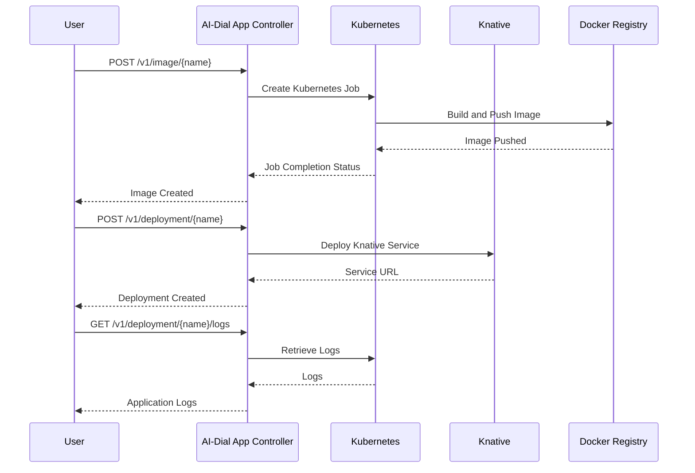

# AI-Dial App Controller

AI-Dial App Controller is a Java-based web service application that orchestrates the building and deployment of Python applications as Knative services on Kubernetes. The application is built using Spring WebFlux and leverages Kubernetes and Knative APIs to manage the lifecycle of applications.

## Features

- Builds a Docker image of a Python application from source code downloaded from [DIAL](https://github.com/epam/ai-dial).
- Deploys the Python application as a [Knative](https://knative.dev/docs/) service on [Kubernetes](https://kubernetes.io/).
- Provides RESTful APIs to manage the lifecycle of applications.

## Prerequisites

- Java 21
- [Docker](https://www.docker.com/)
- [Kubernetes](https://kubernetes.io/) cluster with [Knative](https://knative.dev/docs/) installed
- Access to a Docker registry
- The builder image should be deployed to the registry manually prior to starting the application.

## Setup

1. **Clone the repository:**

   ```bash
   git clone https://github.com/epam/ai-dial-app-controller.git
   cd ai-dial-app-controller
   ```

2. **Build the Docker image:**

   ```bash
   docker build -t ai-dial-app-controller .
   ```

3. **Prepare the Builder Template:**

   Before starting the application, ensure that the builder template image is built and pushed to your Docker registry. This image is used during the build process of Python applications.

   ```bash
   docker buildx build --push -t your-docker-registry/builder-template:latest builder-template
   ```

4. **Run the application with environment variables:**

   ```bash
   docker run -p 8080:8080 \
     -e APP_DOCKER_REGISTRY=your-docker-registry \
     -e APP_DIAL_BASE_URL=https://your-dial-base-url \
     -v ~/.kube/config:/home/appuser/.kube/config \
     ai-dial-app-controller
   ```

## Configuration

The application can be configured using environment variables or by modifying the `application.yaml` file located in `src/main/resources`.

### Environment Variables

| Setting                         | Default                                          | Required   | Description                                                  |
|---------------------------------|--------------------------------------------------|------------|--------------------------------------------------------------|
| `APP_DOCKER_REGISTRY`           |                                                  | Yes        | The Docker registry where images are stored.                 |
| `APP_DIAL_BASE_URL`             |                                                  | Yes        | The base URL for the DIAL service.                           |
| `APP_DEPLOY_NAMESPACE`          | `default`                                        | No         | The Kubernetes namespace used for deploying services.        |
| `APP_BUILD_NAMESPACE`           | `default`                                        | No         | The Kubernetes namespace used for building images.           |
| `APP_HEARTBEAT_PERIOD_SEC`      | `30`                                             | No         | The interval in seconds for sending heartbeat events.        |
| `APP_IMAGE_NAME_FORMAT`         | `app-%s`                                         | No         | Format for naming Docker images.                             |
| `APP_IMAGE_LABEL`               | `latest`                                         | No         | The label used for Docker images.                            |
| `APP_IMAGE_BUILD_TIMEOUT_SEC`   | `300`                                            | No         | Timeout in seconds for building Docker images.               |
| `APP_SERVICE_SETUP_TIMEOUT_SEC` | `300`                                            | No         | Timeout in seconds for setting up Knative services.          |
| `APP_MAX_ERROR_LOG_LINES`       | `20`                                             | No         | Maximum number of error log lines to return in message.      |
| `APP_MAX_ERROR_LOG_CHARS`       | `1000`                                           | No         | Maximum number of error log characters to return in message. |
| `APP_TEMPLATE_IMAGE`            | `${app.docker-registry}/builder-template:latest` | No         | The Docker image used as the template for building.          |
| `APP_BUILDER_IMAGE`             | `gcr.io/kaniko-project/executor:latest`          | No         | The Docker image used for building applications.             |
| `APP_TEMPLATE_CONTAINER`        | `template`                                       | No         | Name of the template container in Kubernetes job.            |
| `APP_BUILDER_CONTAINER`         | `builder`                                        | No         | Name of the builder container in Kubernetes job.             |
| `APP_SERVICE_CONTAINER`         | `app-container`                                  | No         | Name of the service container.                               |
| `APP_DEFAULT_RUNTIME`           | `python3.11`                                     | No         | Default runtime for Python applications.                     |

## Usage

The application exposes RESTful APIs to manage the lifecycle of applications. Below are some of the key endpoints with usage examples:

### Create Image

Builds a Docker image from the specified source code.

**Request:**

```bash
curl -N -X POST http://localhost:8080/v1/image/my-python-app \
     -H "Content-Type: application/json" \
     -H "Authorization: Bearer JWT_TOKEN" \
     -d '{
           "sources": "files/dial bucket/sources folder",
           "runtime": "python3.11"
         }'
```

**Response:**

The response is streamed as Server-Sent Events (SSE). Heartbeats are sent as comments and the result is preceded by "result" event.
Example:
```
:heartbeat

event:result
data:{"image":"your-docker-registry/my-python-app:latest"}
```

### Delete Image

Deletes the Docker image for the specified application.

**Request:**

```bash
curl -N -X DELETE http://localhost:8080/v1/image/my-python-app
```

**Response:**

The response is streamed as SSE. Heartbeats are sent as comments and the result is preceded by "result" event.
Example:
```
:heartbeat

event:result
data:{"deleted":true}
```

### Create Deployment

Deploys the application as a Knative service.

**Request:**

```bash
curl -N -X POST http://localhost:8080/v1/deployment/my-python-app \
     -H "Content-Type: application/json" \
     -d '{
           "env": {
             "ENV_VAR_NAME": "value"
           }
         }'
```

**Response:**

The response is streamed as SSE. Heartbeats are sent as comments and the result is preceded by "result" event.
Example:
```
:heartbeat

event:result
data:{"url":"http://app-ctrl-app-my-python-app.my-domain.com"}
```

### Delete Deployment

Deletes the Knative service for the specified application.

**Request:**

```bash
curl -N -X DELETE http://localhost:8080/v1/deployment/my-python-app
```

**Response:**

The response is streamed as SSE. Heartbeats are sent as comments and the result is preceded by "result" event.
Example:
```
:heartbeat

event:result
data:{"deleted":true}
```

### Get Logs

Retrieves logs for the specified application.

**Request:**

```bash
curl -X GET http://localhost:8080/v1/deployment/my-python-app/logs
```

**Response:**

```json
{
   "logs": [
      {
         "instance": "pod-name",
         "content": "log content"
      }
   ]
}
```

## Sequence Diagram

Below is a detailed sequence diagram illustrating the workflow of building and deploying a Python application:



## License

Copyright (C) 2024 EPAM Systems

Licensed under the Apache License, Version 2.0 (the "License");
you may not use this file except in compliance with the License.
You may obtain a copy of the License at

http://www.apache.org/licenses/LICENSE-2.0

Unless required by applicable law or agreed to in writing, software
distributed under the License is distributed on an "AS IS" BASIS,
WITHOUT WARRANTIES OR CONDITIONS OF ANY KIND, either express or implied.
See the License for the specific language governing permissions and
limitations under the License.